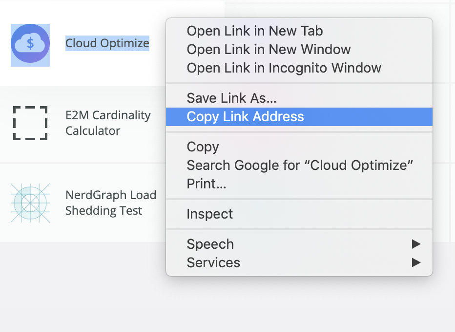

# Installing the New Relic Cloud Journey App

## Getting Started

Please note that this application is only intended to work for customers who plan to migrate, have begun migrating, or have already migrated to AWS.  We are looking to expand this application to support GCP and Azure, but it is currently designed for **AWS only**.

Before proceeding, ensure that the customer's AWS account is properly connected to New Relic by [following the instructions here](https://docs.newrelic.com/docs/integrations/amazon-integrations/get-started/connect-aws-infrastructure).

The customer must also have **Infrastructure installed on all of their on-prem servers and AWS instances, Browser installed for all of their wesbites, and be willing to change their APM application names in order for this application to be truly effective.**

The Cloud Journey App provides a Before, During, and After view of the customer's cloud journey categorized into five key pillars:

* Foundation
* Migration
* Modernization
* Optimization
* Thriving Business

Within these five pillars, the app provides Observability using three different assets:

* Dashboards:  **In order for a large portion of the dashboards to function, the customer must rename all of their on-prem applications to end with** *_OP* **and rename all of their AWS applications to end with** *_AWS*. Alternatively, if a customer has or is willing to place all of their On-Prem assets under one master account and all of their AWS assets under a separate master account, this app can be deployed as two separate applications instead. Regardless of which deployment method you choose, certain NRQL queries contained in the dashboards will require modification. [Click here](./DASHBOARDS.md) for more information.
* Modernization Nerdlet: This will work out of the box but can be customized. [Click here](./MODERNIZATION.md) for more information.
* [Optimization Needpack](https://github.com/newrelic/nr1-cloud-optimize): This will work out of the box

## Pre-requesites

* Nerdpack Manager privileges within the account you wish to deploy to
* Optimization Nerdpack: this must be deployed into the account first
* Insights Query key for the account

## Installation

First, ensure that you have [Git](https://git-scm.com/book/en/v2/Getting-Started-Installing-Git) and [NPM](https://www.npmjs.com/get-npm) installed. If you're unsure whether you have one or both of them installed, run the following command(s) (If you have them installed these commands will return a version number, if not, the commands won't be recognized):

```bash
git --version
npm -v
```

Next, install the [NR1 CLI](https://one.newrelic.com/launcher/developer-center.launcher) by going to [this link](https://one.newrelic.com/launcher/developer-center.launcher) and following the instructions (5 minutes or less) to install and setup your New Relic development environment.

Next, install the [Optimization Needpack](https://github.com/newrelic/nr1-cloud-optimize).

Next, to clone this repository and run the code locally against your New Relic data, execute the following commands(**You will need to enter 'y' when prompted to create a new UUID for the application**):

```bash
nr1 nerdpack:clone -r https://github.com/newrelic/nr1-csg-cloud-journey.git
cd nr1-csg-cloud-journey
npm update
nr1 nerdpack:uuid --generate
```

**If you are deploying this application to an account that contains only On-Prem server resources, execute the following command**

```bash
python before-and-after.py before
```

**If you are deploying this application to an account that contains only AWS resources, execute the following command**

```bash
python before-and-after.py after
```
Before executing the following command, which will configure the application to run inside the account of your choosing, please ensure you have the account number and the account's Insights query key in hand.

```bash
python configure.py
```

Before launching the application, you will need to modify certain queries in the dashboards provided.  [Click here](./DASHBOARDS.md) for more information.

Lastly, you must edit the application to point to the installation of the Optimization Nerdpack that you installed in a previous step.  You must manually edit the following file:

>nerdlets/nr1-csg-cloud-journey-nerdlet/components/cloud-journey/components/optimization/index.js

Edit the following line to reflect the URL of the Optimization Nerdpack that you deployed previously:

> navigation.openStackedNerdlet({id: '1805f171-b49b-443f-ae0e-590b4362a1fa.cloud-optimize-nerdlet'})} />

You can locate the URL by visting the New Relic One homepage as shown below.



Your URL should look similar to:

>https://one.newrelic.com/launcher/d0561f78-c787-454a-8fe8-e27c1949f97f.nr1-csg-cloud-journey-launcher

You will need the last part of the URL **and will need to change** *-launcher* to *-nerdlet*:

>d0561f78-c787-454a-8fe8-e27c1949f97f.nr1-csg-cloud-journey-launcher

Once you have satisfied the configuration requirements above, run the following command to launch the application:

```bash
nr1 nerdpack:serve
```

Visit [https://one.newrelic.com/?nerdpacks=local](https://one.newrelic.com/?nerdpacks=local), navigate to the Nerdpack, and :sparkles:

## Deploying this Nerdpack

Open a command prompt in the nerdpack's directory and run the following commands.

```bash
# If you need to create a new uuid for the account to which you're deploying this Nerdpack, use the following
# nr1 nerdpack:uuid -g [--profile=your_profile_name]
# to see a list of APIkeys / profiles available in your development environment, run nr1 credentials:list
nr1 nerdpack:publish [--profile=your_profile_name]
nr1 nerdpack:deploy [-c [DEV|BETA|STABLE]] [--profile=your_profile_name]
nr1 nerdpack:subscribe [-c [DEV|BETA|STABLE]] [--profile=your_profile_name]
```

Visit [https://one.newrelic.com](https://one.newrelic.com), navigate to the Nerdpack, and :sparkles:

## Support

New Relic has open-sourced this project. This project is provided AS-IS WITHOUT WARRANTY OR SUPPORT, although you can report issues and contribute to the project here on GitHub.

_Please do not report issues with this software to New Relic Global Technical Support._
